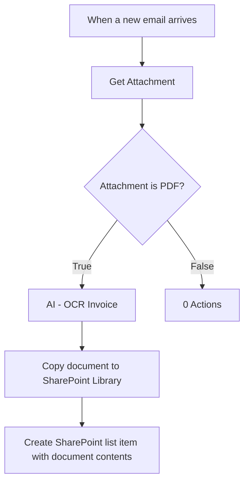
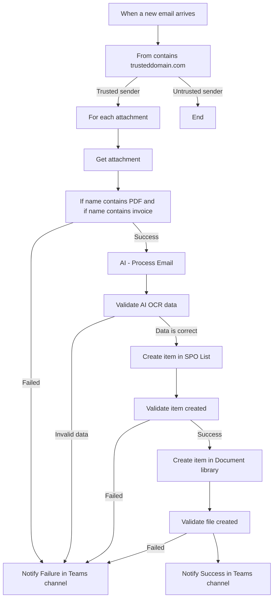

# Save Attachments in SharePoint and Create List Item

## Get new email attachments and copy to SharePoint Document Library, read contents and populate SharePoint List

This Power Automate flow will trigger when a message is received into a mailbox. The attached invoice will be read and copied to a SharePoint document library. The data in the invoice will be read and entered into a SharePoint List.

This process requires an Encodian API key as it uses [PDF - Apply OCR (All)](https://support.encodian.com/hc/en-gb/articles/14286080106908-PDF-Apply-OCR-AI)

You can get an Encodian API key - 30 day free trial (No card) [Get an API Key](https://support.encodian.com/hc/en-gb/articles/360034587474-Get-an-API-Key-30-Day-Trial-Subscription)

This process requires a SharePoint List with the following columns:
• InvoiceDate
• InvoiceTotal
• InvoiceID

The example PDF contains a simple data sample:
```
INVOICE - BlueWaterKitchens 
Amount: £400 
Date: 15/6/2025 
Number: 123456
```

## Initial Flow Configuration

**Trigger:** When a new email arrives  
**To:** Email address to monitor  
**Include Attachments:** Yes

**Condition:** For each  
**Select an output from previous steps:** Attachments

### In For Each Loop

**Action:** Get Attachment  
**Message Id:** `triggerOutputs()?['body/id']`  
**Attachment Id:** `items('For each')?['id']`

**Condition:**
```json
"and": [
    {
        "contains": [
            "@outputs('Get_Attachment')?['body/name']",
            ".pdf"
        ]
    }
]
```

**True:**
**Action:** AI - Process Invoice
- **Parameters:** `outputs('Get_Attachment')?['body/contentBytes']`

**Action:** Create Item (SharePoint Action)
- **Site Address:** URL of Site Collection
- **List Name:** Name of List
- **Title:** `outputs('Get_Attachment')?['body/name']`
- **InvoiceDate:** `json(outputs('AI_-_Process_Invoice')?['body/result'])['InvoiceDate']`
- **InvoiceTotal:** `json(outputs('AI_-_Process_Invoice')?['body/result'])['InvoiceTotal']`
- **InvoiceID:** `json(outputs('AI_-_Process_Invoice')?['body/result'])['InvoiceId']`

**Action:** Create file (SharePoint Action)
- **Site Address:** URL of Site Collection  
- **Folder Path:** `/Shared Documents`
- **File Name:** `outputs('Get_Attachment')?['body/name']`
- **File Content:** `outputs('Get_Attachment')?['body/contentBytes']`



This process flow will complete the designed task. At the end, you will have a copy of the document in SharePoint and you will have a list item containing the data from the document.

This is not production ready - this is an example of a process. I created a basic version so that I could highlight where it can be improved. The next section will change this concept flow into something that is robust and ready to be used by a business.

## What is wrong with this flow?

There are quite a few things wrong with this flow, and anyone experienced with processes will be relieved that I am presenting this as unfinished.

Let's start at the top and work down:
• The flow attempts to process all emails received into the inbox
• The flow assumes that there are attachments
• If there is an attachment that is not a PDF, the flow has no actions - it just stops
• The flow does not check to ensure that the AI - OCR step is getting the data from the PDF correctly
• The flow assumes that the item is created successfully in the SharePoint list. There is no validation that the data added is correct
• The item is created in the SharePoint document library with no validation that it is an invoice

If this was placed into production as it stands, then it would error within a few runs. An email would have an attachment that you don't want to process and errors would occur. The process cannot handle anything that does not explicitly fall into the scenario.

Examples of problematic scenarios:
• A logo could be added as an attachment
• A non-invoice PDF
• An old invoice that has already been processed
• An invoice created on the wrong template

## How can the flow be improved?

1. Ensure the flow only processes what it needs to
2. Check that every step is doing what it is supposed to, and that it is doing it successfully
3. If a step fails, ensure a valid error is sent to the right person or team

## Let's fix the flow

**Trigger:** When a new email arrives  
**To:** Email address to monitor  
**Include Attachments:** Yes  
**Subject Filter:** Invoice  
**Only with Attachments:** Yes

**Condition:**
```json
"and": [
    {
        "contains": [
            "@triggerOutputs()?['body/from']",
            "mytrusteddomain.com"
        ]
    }
]
```

**Condition:** For each  
**Select an output from previous steps:** Attachments

### In For Each Loop

**Action:** Get Attachment  
**Message Id:** `triggerOutputs()?['body/id']`  
**Attachment Id:** `items('For each')?['id']`

**Condition:**
```json
"and": [
    {
        "contains": [
            "@outputs('Get_Attachment')?['body/name']",
            ".pdf"
        ]
    },
    {
        "contains": [
            "@outputs('Get_Attachment')?['body/name']",
            "invoice"
        ]
    }
]
```

**True:**
- **Action:** AI - Process Invoice
- **Parameters:** `outputs('Get_Attachment')?['body/contentBytes']`

**Condition:**
```json
"and": [
    {
        "equals": [
            "@outputs('AI_-_Process_Invoice')?['body/result']",
            200
        ]
    },
    {
        "equals": [
            "@isDate(json(outputs('AI_-_Process_Invoice')?['body/result'])['InvoiceDate'])",
            true
        ]
    },
    {
        "equals": [
            "@not(empty(json(outputs('AI_-_Process_Invoice')?['body/result'])['InvoiceTotal']))",
            true
        ]
    },
    {
        "equals": [
            "@not(empty(json(outputs('AI_-_Process_Invoice')?['body/result'])['InvoiceId']))",
            true
        ]
    }
]
```

- **Action:** Create Item (SharePoint Action)
- **Site Address:** URL of Site Collection
- **List Name:** Name of List
- **Title:** `outputs('Get_Attachment')?['body/name']`
- **InvoiceDate:** `json(outputs('AI_-_Process_Invoice')?['body/result'])['InvoiceDate']`
- **InvoiceTotal:** `json(outputs('AI_-_Process_Invoice')?['body/result'])['InvoiceTotal']`
- **InvoiceID:** `json(outputs('AI_-_Process_Invoice')?['body/result'])['InvoiceId']`

**Condition:**
```json
"and": [
    {
        "equals": [
            "@not(empty(outputs('Create_item')?['body/ID']))",
            true
        ]
    }
]
```

- **Action:** Create file (SharePoint Action)
- **Site Address:** URL of Site Collection  
- **Folder Path:** `/Shared Documents`
- **File Name:** `outputs('Get_Attachment')?['body/name']`
- **File Content:** `outputs('Get_Attachment')?['body/contentBytes']`

**Condition:**
```json
"and": [
    {
        "not": {
            "equals": [
                "@outputs('Create_file')?['body/ItemId']",
                ""
            ]
        }
    }
]
```

As well as making changes to the error checking in the Power Automate flow, I have also added output messages to a Teams channel for each failure and for success once every step completes.

Example:

**Action:** Reply with a message in a channel  
**Post as:** Flow bot  
**Post in:** Channel  
**Message ID:** `triggerOutputs()?['body/from']`  
**Team:** {Team}  
**Channel:** {Channel}  
**Message:**
```html
<p class="editor-paragraph">The flow was unable to get the attachment from the invoice email.</p>
<p class="editor-paragraph">From: @{triggerOutputs()?['body/from']}</p>
<p class="editor-paragraph">Invoice title: @{outputs('Get_Attachment')?['body/name']}</p>
```



## If you really want to elevate this to Enterprise level then you could do this...

**Observability & Monitoring**
• Log Analytics integration for structured event logging
• Grafana dashboards for real-time operational visibility
• Proactive alerting on error thresholds and volume anomalies

**Governance & Compliance**
• Audit trail preservation for regulatory requirements
• Data retention policies aligned with business needs
• Access controls and approval workflows for sensitive invoices

**Scalability & Performance**
• Queue-based processing for high-volume scenarios
• Parallel processing for multiple attachments
• Resource throttling and load balancing

**Advanced Error Handling**
• Circuit breaker patterns for dependent services
• Dead letter queues for failed messages
• Automated escalation to human reviewers

### Enhanced Monitoring with Log Analytics

Add a "Send Data" action after each major step to capture structured events:

```json
{
  "timestamp": "2025-06-23T10:30:00Z",
  "workflow": "InvoiceProcessing",
  "step": "OCR_Processing",
  "status": "success",
  "invoiceId": "123456",
  "processingTime": 2300,
  "fileName": "invoice_BWK_123456.pdf",
  "confidence": 0.92
}
```

**PowerAutomate Implementation:**
• **Action:** Send Data (Log Analytics)
• **Workspace ID:** Your Log Analytics workspace
• **JSON Body:** Structured event data
• **Custom Log Name:** InvoiceProcessing_CL

This enables:
• Real-time Grafana dashboards showing processing volume, error rates, and performance metrics
• Business intelligence reporting on monthly processing volumes and vendor-specific success rates
• Proactive alerting when error rates exceed thresholds or unusual volume spikes occur